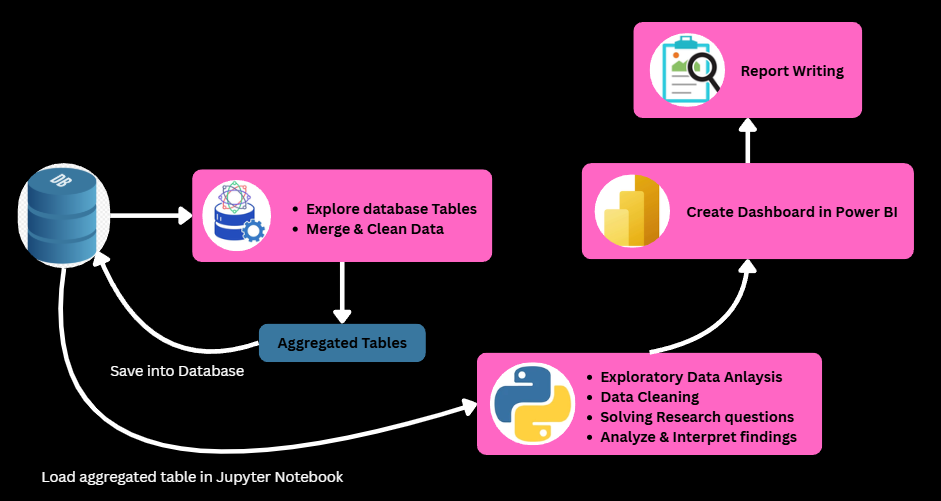

# 
📊 Vendor Performance Analysis Project

  
  
  
  
  
  

> **Author**: Zodrick John  
> **Institution**: UIET, Panjab University

---

## 🧠 Objective

To evaluate vendor performance using real-world procurement and sales data. This project leverages SQL, Python (Pandas), and Power BI to derive insights for better vendor management, pricing decisions, and inventory optimization.

---

## 🔁 Project's Workflow

---

## 🧰 Tools & Technologies
 - SQL – Data extraction and merging
 - Python (Jupyter Notebook) – EDA, data cleaning, hypothesis testing
 - Pandas, Matplotlib, Seaborn – Data wrangling and visualization
 - Power BI – Interactive dashboards and KPIs

---

## 📊 Analysis Performed
 - ✅ Exploratory Data Analysis
 - ✅ Outlier Detection (Boxplots)
 - ✅ Data Filtering
 - ✅ Correlation Analysis
 - ✅ Hypothesis Testing (Profit Margin differences)
 - ✅ Power BI Visualization

---

## 📌 Key Metrics & KPIs

| 🧮 **Metric**            | 📊 **Value** |
|--------------------------|--------------|
| Total Purchase ($)       | 307.34M      |
| Total Sales ($)          | 441.41M      |
| Gross Profit ($)         | 134.07M      |
| Profit Margin (%)        | 38.72%       |
| Unsold Capital ($)       | 2.71M        |

---

## 📈 Power BI Dashboard Highlights

 - 🔟 Top Vendors: Diageo North America, Martignetti Co, etc.
 - 📉 Lowest Performing Vendors: Based on profit contribution
 - 🧪 Low Performing Brands: Sales vs. Margin scatter plot
 - 💡 Insights:
       -- 65% of total purchases are concentrated with 10 vendors
       -- Some vendors maintain high profit margins but low sales
       -- Bulk purchases reduce unit cost by ~72%

---

## 🔍 Key Insights
 - 📈 High-margin, low-volume brands could benefit from promotion
 - ⚠️ Over-reliance on a few vendors introduces supply risk
 - 🛑 $2.71M in unsold inventory due to low turnover
 - 💸 Bulk purchases reduce unit costs significantly

---

